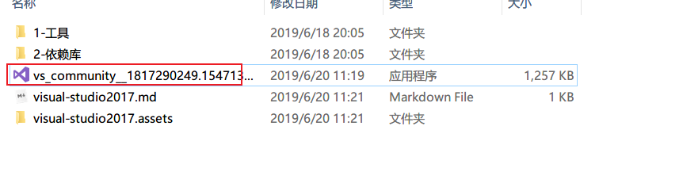
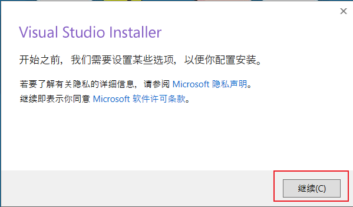
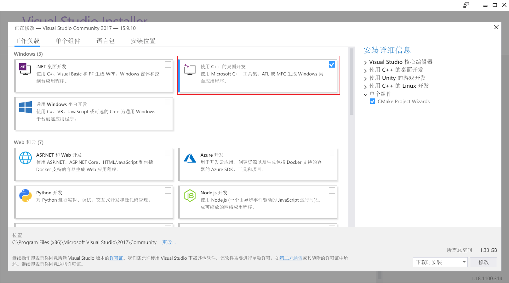
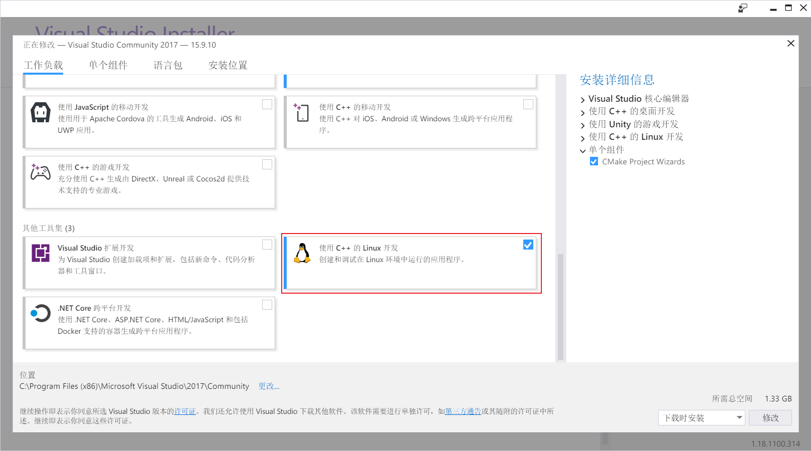
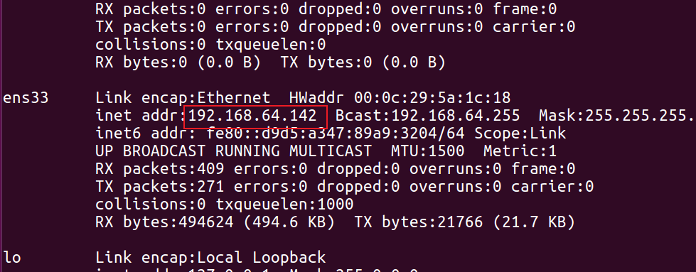
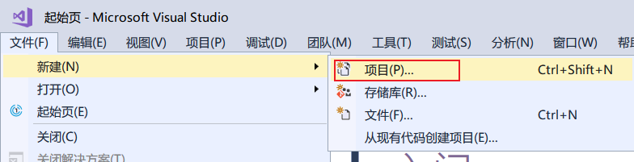
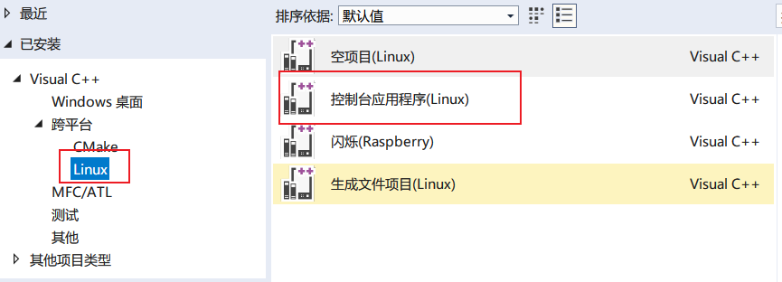
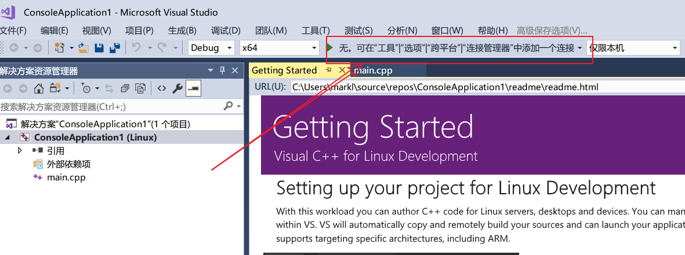
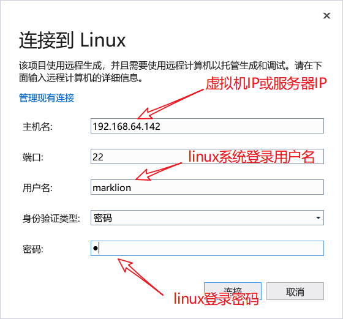
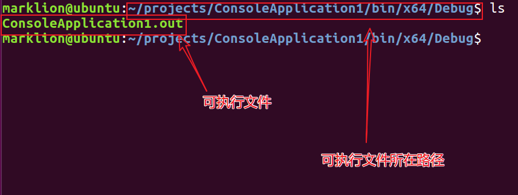

# VS2017安装和跨平台使用

## 一，安装VS2017

### 1. 打开在线安装工具

双击打开`vs_community__1817290249.1547130100.exe`

点击继续

### 2. 勾选安装组件

选择VC++和跨平台linux即可

### 3.点击安装按钮后静等（保持网络畅通）

## 二，VS2017跨平台开发linux方法

### 1.打开linux虚拟机并记录IP或获取linux服务器IP

### 2.打开vs2017并创建linux跨平台项目

点击创建后会显示使用帮助信息，初次创建跨平台项目需要配置远程连接信息

填入对应的信息

点击连接后静等，项目会被编译，然后闪过一个"hello-world"后恢复平静

### 3.linux下查看项目

缺省情况下，vs会将项目中的代码拷贝到linux用户的家目录下的project目录下，然后远程调用linux系统的gcc对项目进行编译，编译结果在bin目录下。

